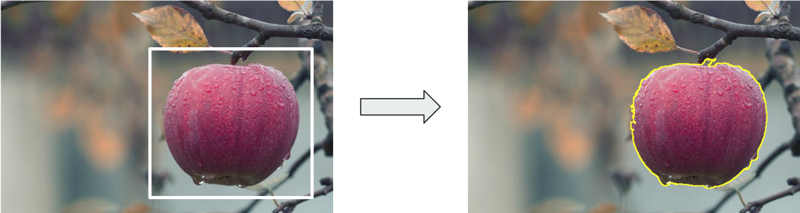
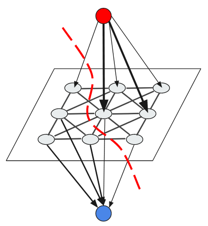
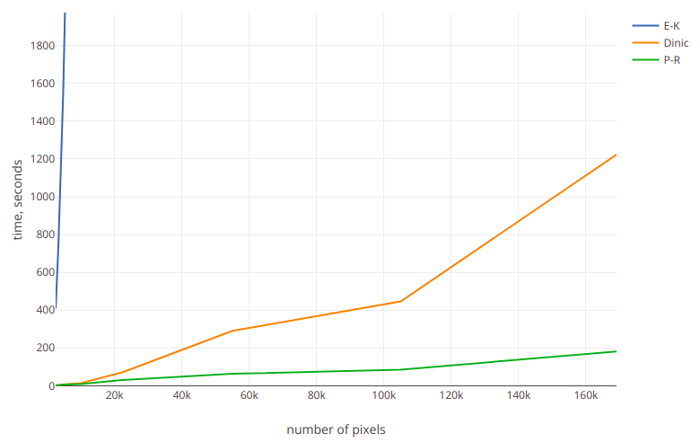
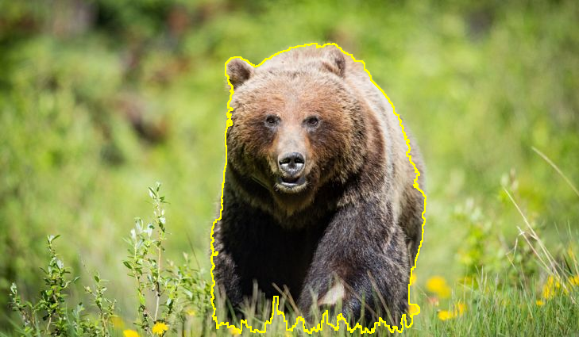
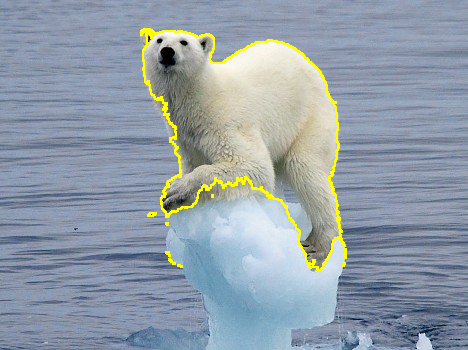
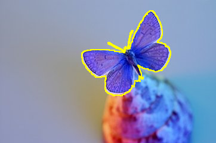

# image-segmentation

A simple program that separates an image into foreground and background inside of specified rectangular area leveraging a basic graph cut technique. The following picture demonstrates how it works:

## Approach

The idea is to represent each pixel as a vertex of the graph and also have two more vertices - source and sink.
Each pixel is connected to adjacent pixels and to the source and the sink.

Clearly, this approach has many limitations but it works on simple input.

In general, the process consists of the following steps:
* Represent each pixel as a graph vertex
* Add two terminal vertices: source and sink (red and blue on the picture)
* Connect each non-terminal vertex with neighbors (binary component) and with terminal vertices (unary component)
* Find minimum cut

The minimum cut gives the separation between foreground and background because all vertices are divided into two sets: reachable from source vertex and non-reachable.

## Algorithms

In order to find min-cut/max-flow in a graph and also to compare the performance of different algorithms, the following ones were implemented:
* Edmonds-Karp
* Dinic
* Push-Relabel

Basic performance comparison is displayed on the chart. Push-Relabel algorithm is the fastest one and therefore was used to process images.

## Samples

  

---

  

---

  

---

  

